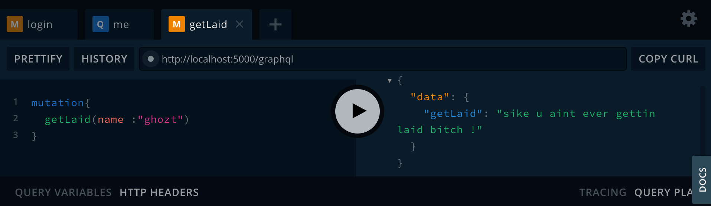

# Mutation is my middle name



### scripts :

- To Start in Dev Mode using the JS compiled version using nodemon (recommended)

```
    yarn dev
```

- To Run TSC Compiler in Watch Mode (recommended)

```
    yarn watch
```

- To Start in Dev Mode using the raw TS Source Code using nodemon (TS)

```
    yarn devTs
```

- To Start the Server using ts-node

```
    yarn startTs
```

- To Start the Server

```
    yarn start
```

### Redis Commands :

- To Start server

```
    redis-server
```

- To view all the sessions that are stored :

1. Open Redis CLI

```
    redis-cli
```

2. Get the keys :

```
    keys *
```
